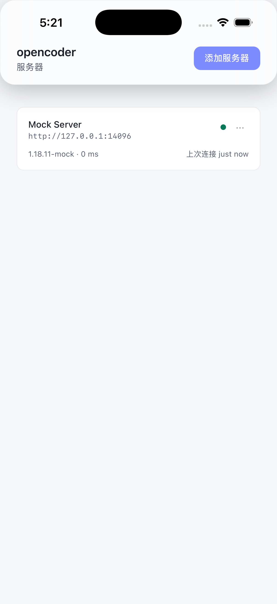
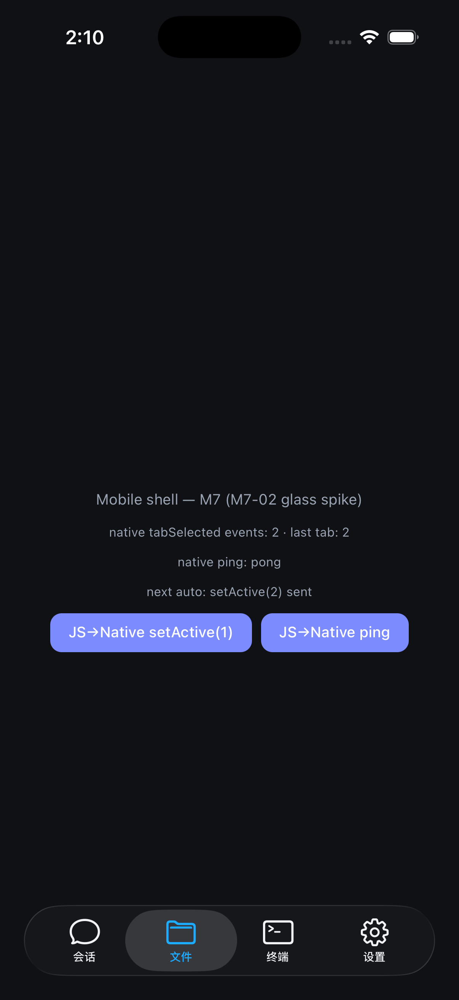

# opencoder

**[OpenCode](https://opencode.ai) 的跨平台桌面与移动客户端** — 一套代码库，五个平台（macOS / Windows / Linux / iOS / Android），基于 [Tauri 2](https://tauri.app) 与 [SolidJS](https://www.solidjs.com) 构建。


[English](./README.md)

## 功能特性

- **多服务器管理** — 一个应用同时连接任意多个 `opencode serve` 实例：实时健康检查（含版本/延迟读数）、断线自动重连并对齐状态、局域网 mDNS 自动发现、服务器导航首页，以及把任意服务器以二维码分享给手机
- **双形态 UI** — 桌面壳（鼠标 + 快捷键 + 自定义标题栏 + 系统托盘）与移动壳（触屏优先、系统返回键、触觉反馈、分享接收），共享同一组件库
- **完整 API 覆盖** — 按优先级分阶段实现 162 端点的完整 OpenAPI 契约（见 [docs/api-coverage.md](docs/api-coverage.md)）
- **流式优先的聊天** — 文本、工具调用、思考与待办实时流式渲染；支持中断、权限请求、提问、斜杠命令、fork / revert / share、会话 diff 与 AGENTS.md 生成
- **文件、搜索、diff 与 VCS** — 懒加载文件树、⌘P 快速打开、全文搜索命中跳转、统一/分栏会话 diff、git 感知状态栏
- **内置终端** — xterm.js 经 Rust PTY 通道，桌面与移动端均可用
- **Liquid Glass（iOS 26）** — 原生半透明 tab bar 与材质，贴合 Apple 新一代设计语言（见 [docs/ui-design.md](docs/ui-design.md)）
- **萌宠陪伴** — 独立置顶透明窗口中的桌面萌宠，随编码事件联动（工作中/等待权限/成功/出错…）
- **i18n 先行** — 首日即支持 English 与简体中文，运行时一键切换
- **主题与强调色** — 深色 / 浅色 / 跟随系统（移动端另有 OLED 纯黑），六种预设强调色或自定义色值，支持按服务器覆盖
- **隐私优先设计** — WebView 永不直连服务器：所有 REST/SSE/WebSocket 流量都经过 Rust 传输层（ADR-002），天然规避 CORS 与 iOS ATS 限制

## 截图

| 桌面 — 服务器主页                                    | 桌面 — 聊天                                    | 桌面 — 文件                                     | 桌面 — 聊天（深色）                                     |
| ---------------------------------------------------- | ---------------------------------------------- | ----------------------------------------------- | ------------------------------------------------------- |
|  |  |  |  |

| iOS — 服务器主页（iPhone 17 / iOS 26）           | iOS — Liquid Glass                                  |
| ------------------------------------------------ | --------------------------------------------------- |
|  |  |

桌面截图展示应用 UI 以开发模式驱动 [Mock OpenCode Server](docs/testing.md) 的实况；iOS 截图拍摄于 iPhone 17 模拟器（iOS 26.0），其中服务器主页已连接宿主机上的 Mock OpenCode Server（127.0.0.1）。

## 服务端要求

opencoder 是纯客户端：它连接一个或多个 **OpenCode 服务器**。

- **服务器**：[opencode](https://opencode.ai) CLI，**v1.18.11 或更高** — API 契约版本锁定于 `docs/openapi_v1.18.11.json`（OpenAPI 3.1）
- **启动服务器**：

  ```bash
  opencode serve --port 4096         # 监听 TCP 4096 端口
  opencode serve --port 4096 --mdns  # 同时在局域网广播，支持一键 mDNS 发现
  ```

- **密码认证（可选）**：启动前设置 `OPENCODE_SERVER_PASSWORD` 环境变量即可要求密码；应用连接时提示输入并以 HTTP Basic Auth 发送
- **局域网 / 远程服务器**：任何可达的 `opencode serve` 实例均可 — 手动输入 URL，或用手机扫描其二维码

## 安装

| 平台    | 渠道                                                                                                                                              |
| ------- | ------------------------------------------------------------------------------------------------------------------------------------------------- |
| macOS   | 从 [GitHub Releases](https://github.com/charleypeng/opencoder/releases) 下载 universal `.dmg`（arm64 + x86_64）；配置 Apple 凭证后自动签名 + 公证 |
| Windows | NSIS `.exe` 与 MSI `.msi` 安装包                                                                                                                  |
| Linux   | `.deb` 与 AppImage 包                                                                                                                             |
| iOS     | TestFlight / App Store（真机构建需 Apple 开发者团队；开发期使用未签名模拟器构建）                                                                 |
| Android | CI 构建的 APK/AAB — 构建链已脚手架化并通过 CI 验证，release 签名（keystore）待配置                                                                |

桌面端内置自动更新。首个公开版本为 `v1.0.0`（M10-06）；签名与移动端发布细节见 [docs/mobile-signing.md](docs/mobile-signing.md) 与 [docs/release-signing.md](docs/release-signing.md)。

## 快速开始

1. **安装**对应平台的应用（见上），并启动一个服务器（`opencode serve --port 4096`）。
2. **添加服务器** — 服务器主页 → 添加服务器 → 名称 + URL → 测试连接 → 保存。同一局域网内可从 mDNS 发现的列表一键添加；手机端可直接扫描二维码。
3. **新建会话并发送消息** — 按 **⌘Enter**（或 Ctrl+Enter）。文本、工具调用、思考与待办实时流式呈现。

## 键盘快捷键

主修饰键在 macOS 为 **⌘**、其他平台为 **Ctrl**（各平台两者均生效）。所有快捷键都可在 设置 → 快捷键 中重新绑定。

| 快捷键      | 动作                                 |
| ----------- | ------------------------------------ |
| `⌘K`        | 命令面板                             |
| `⌘N`        | 新建会话                             |
| `⌘P`        | 快速打开文件                         |
| `⌘⇧F`       | 全文搜索                             |
| `⌘1` – `⌘9` | 切换服务器                           |
| `⌘[` / `⌘]` | 上一个 / 下一个会话                  |
| `⌘Enter`    | 发送消息（聊天输入框内）             |
| `Esc`       | 中断生成 / 关闭浮层                  |
| `⌘B`        | 切换侧边栏                           |
| `⌘J`        | 切换终端                             |
| `⌘D`        | 会话 diff                            |
| `⌘,`        | 打开设置                             |
| `Tab`       | 切换输入框中的 agent（聊天输入框内） |
| `↑`         | 召回上一条提示词（空输入时）         |

## 架构概览

```
┌───────────────────────────────────────────────────────────┐
│                  SolidJS 前端（一套代码）                    │
│  桌面壳 · 移动壳 · 共享功能模块                              │
│  Stores（按服务器切片）← Services（API 抽象层）              │
│               ApiClient / SSE 门面（TS）                    │
└───────────────────────────┬───────────────────────────────┘
                    Tauri IPC（invoke / Channel）
┌───────────────────────────▼───────────────────────────────┐
│                     Rust 核心（src-tauri）                  │
│   transport: http（REST）· sse · ws（PTY）                  │
│   connections · 健康监控 · mDNS 发现                        │
│   萌宠窗口 · glass 插件（iOS/macOS）                        │
└───────────────────────────┬───────────────────────────────┘
                 HTTP / SSE / WebSocket（reqwest）
      opencode serve（本地）   （LAN / mDNS）   （远程）
```

所有到 OpenCode 服务器的网络流量都经过 Rust 传输层（ADR-002）：WebView 不发起任何跨域请求，天然规避 CORS 与 iOS ATS 拦截；SSE/WebSocket 连接的生命周期独立于 WebView。SSE delta 在 Rust 侧按 16ms 帧批量推送并过滤无用事件；健康监控轮询 `/global/health` 并驱动重连状态机。详见 [docs/architecture.md](docs/architecture.md)。

## 技术栈

| 层       | 选型                                                                     |
| -------- | ------------------------------------------------------------------------ |
| 应用框架 | Tauri 2.x（Rust）                                                        |
| 前端框架 | SolidJS + TypeScript                                                     |
| 构建     | Vite 6 + `@solidjs/router`                                               |
| 样式     | Tailwind CSS v4 + CSS 变量设计令牌                                       |
| 组件基座 | Kobalte（无障碍 headless 组件）                                          |
| API 类型 | `openapi-typescript` 从 OpenAPI 3.1 规范生成                             |
| 传输层   | Rust `reqwest`（REST + SSE + WebSocket），WebView 零直连                 |
| 终端     | xterm.js，经 Rust WebSocket/PTY 通道                                     |
| 状态     | Solid stores，按服务器维度切片                                           |
| i18n     | i18next + `solid-i18next`（English + 简体中文）                          |
| 萌宠     | 置顶透明窗口（桌面）；预留 Rive 渲染器接口                               |
| 代码质量 | ESLint + Prettier + clippy/fmt + husky/lint-staged + axe-core 无障碍巡检 |

## 开发指南

前置要求：Node.js >= 20、pnpm、Rust 工具链（桌面构建需要）。

```bash
pnpm install        # 安装依赖
pnpm tauri dev      # 以开发模式运行桌面应用（Rust 传输层）
```

常用脚本：

| 命令                   | 用途                                                                                |
| ---------------------- | ----------------------------------------------------------------------------------- |
| `pnpm verify`          | 质量门禁：lint + 格式 + 类型检查 + 链接 + 测试 + codegen 漂移检测（提交前必须通过） |
| `pnpm test`            | 单元测试（vitest）                                                                  |
| `pnpm test:coverage`   | 单元测试 + 覆盖率门禁（`src/services/**`、`src/stores/**`）                         |
| `pnpm test:e2e`        | Playwright 端到端旅程（12 条），对接 mock 服务器                                    |
| `pnpm check:links`     | 面向用户的文档 Markdown 链接检查                                                    |
| `pnpm check:i18n`      | i18n 键完整性 + en/zh 键集合一致性                                                  |
| `pnpm mock:start`      | 启动 Mock OpenCode Server（Node，REST + SSE + 场景脚本）                            |
| `pnpm mock:test`       | Mock Server 自测                                                                    |
| `pnpm gen:api`         | 从 OpenAPI 契约重新生成 API 类型                                                    |
| `pnpm gen:api:check`   | 校验已提交类型与契约一致（CI 使用）                                                 |
| `pnpm fixtures:record` | 从真实 `opencode serve` 录制 fixture（需提供 base URL）                             |

纯浏览器开发使用开发专用传输层：`VITE_TRANSPORT=fetch pnpm dev` 直连 mock 服务器，E2E 时以 shim 模拟 Tauri 桥（见 [docs/testing.md](docs/testing.md) §3 L4）。

移动端构建：

- **iOS**：`pnpm tauri ios build --target aarch64-sim --ci --no-sign` 产出未签名模拟器应用；真机构建与 TestFlight/App Store 步骤见 [docs/mobile-signing.md](docs/mobile-signing.md)
- **Android**：需本地 Android SDK/JDK（`tauri android init` 脚手架生成 `gen/android`，CI 侧另有生成）；debug 构建自动签名，release 构建需 keystore — 见 [docs/mobile-signing.md](docs/mobile-signing.md)

### API 契约与类型生成

- 基准：`docs/openapi_v1.18.11.json`（OpenAPI 3.1，版本锁定）
- 生成类型：`src/services/api/schema.d.ts`（`openapi-typescript`，脚本 `scripts/gen-api.mjs`）

契约升级流程：替换版本化规范文件 → `pnpm gen:api` → `pnpm gen:api:check` → `pnpm exec tsc -b` → 两个文件一并提交。

## 文档地图

| 文档                                               | 内容                                        |
| -------------------------------------------------- | ------------------------------------------- |
| [docs/PLAN.md](docs/PLAN.md)                       | 总体规划、里程碑、决策点                    |
| [docs/architecture.md](docs/architecture.md)       | 技术架构、目录结构、数据流                  |
| [docs/api-coverage.md](docs/api-coverage.md)       | 162 端点 → 功能域 → 优先级/里程碑映射       |
| [docs/ui-design.md](docs/ui-design.md)             | 设计系统、桌面/移动形态、Liquid Glass、萌宠 |
| [docs/testing.md](docs/testing.md)                 | 分层测试体系、Mock Server、CI               |
| [docs/glossary.md](docs/glossary.md)               | 术语约定（en/zh）                           |
| [docs/a11y-report.md](docs/a11y-report.md)         | 无障碍巡检报告（axe-core，WCAG 2.x AA）     |
| [docs/performance.md](docs/performance.md)         | 性能预算与测量                              |
| [docs/mobile-signing.md](docs/mobile-signing.md)   | iOS/Android 签名、TestFlight、上架清单      |
| [docs/release-signing.md](docs/release-signing.md) | 桌面三平台签名与公证                        |
| [docs/AGENT_PLAYBOOK.md](docs/AGENT_PLAYBOOK.md)   | 子 Agent 执行手册（任务卡格式、提交规范）   |
| [docs/tasks/M0.md … M10.md](docs/tasks/M0.md)      | 83 个可执行任务卡                           |

## 贡献

开发环境搭建、分支与提交规范、测试纪律见 [CONTRIBUTING.md](CONTRIBUTING.md)。

## 变更记录

发布历史见 [CHANGELOG-zh.md](CHANGELOG-zh.md)。

## 许可证

[MIT](LICENSE)
