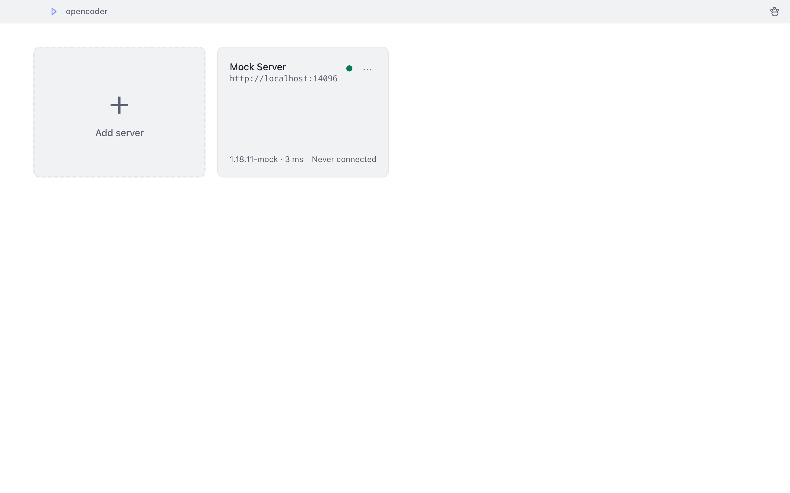
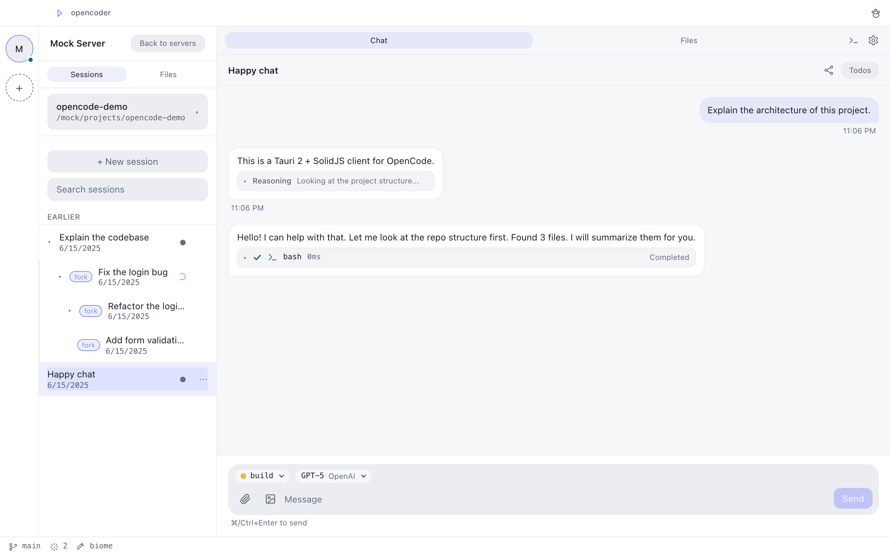
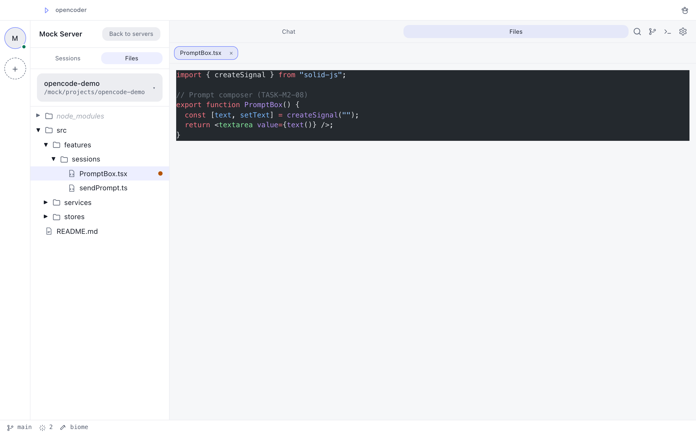
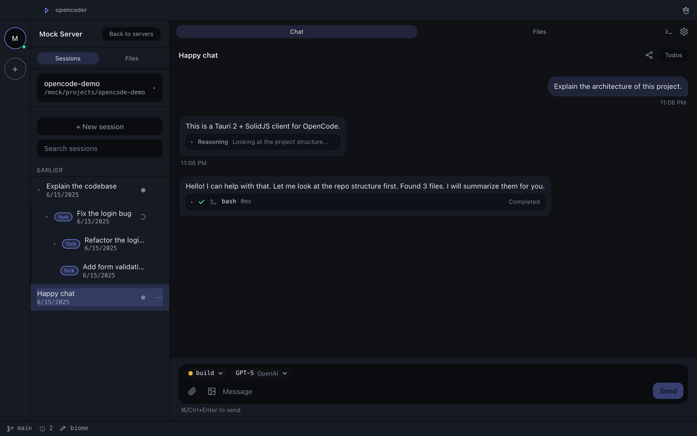

# opencoder

**The desktop & mobile client for [OpenCode](https://opencode.ai)** — one codebase, five platforms (macOS / Windows / Linux / iOS / Android), built with [Tauri 2](https://tauri.app) and [SolidJS](https://www.solidjs.com). **v1.0.0 ships the three desktop platforms**; iOS and Android are in development (see [docs/mobile-signing.md](docs/mobile-signing.md)).


[简体中文](./README-zh.md)

## Features

- **Multi-server management** — connect to any number of `opencode serve` instances from one app: live health checks (with version/latency readouts), automatic reconnection with state realignment, mDNS auto-discovery on your LAN, and a server home page with a QR code to share any server with your phone
- **Dual-form UI** — a desktop shell (mouse + shortcuts + custom title bar + tray) and a mobile shell (touch-first, system back, haptics, share-receive), sharing one component library
- **Full API coverage** — the entire 162-endpoint OpenAPI contract implemented stage by stage (see [docs/api-coverage.md](docs/api-coverage.md))
- **Streaming-first chat** — text, tool calls, reasoning and todos stream in live; interrupt, permission requests, questions, slash commands, fork / revert / share, session diff and AGENTS.md generation included
- **Files, search, diff & VCS** — file tree with lazy loading, ⌘P quick open, full-text search with hit jumps, unified/split session diffs and a git-aware status bar
- **Built-in terminal** — xterm.js over a Rust PTY channel, on desktop and mobile
- **Liquid Glass (iOS 26)** — native translucent tab bar + materials on Apple's new design language (see [docs/ui-design.md](docs/ui-design.md))
- **Mascot pet** — a desktop companion in its own always-on-top window that reacts to coding events (working, waiting for permission, success, error…)
- **i18n first** — English and Simplified Chinese from day one, switchable at runtime
- **Themes & accents** — dark / light / system (+ OLED true-black on mobile) with six accent presets or a custom color, per-server overrides
- **Private by design** — the WebView never talks to your servers directly: all REST/SSE/WebSocket traffic flows through the Rust transport layer (ADR-002), immune to CORS and iOS ATS restrictions

## Screenshots

| Desktop — servers home                                     | Desktop — chat                                     | Desktop — files                                      | Desktop — chat (dark)                                        |
| ---------------------------------------------------------- | -------------------------------------------------- | ---------------------------------------------------- | ------------------------------------------------------------ |
|  |  |  |  |

Desktop screenshots show the app UI driven by the [Mock OpenCode Server](docs/testing.md) in dev mode.

## Requirements

opencoder is a pure client: it talks to one or more **OpenCode servers**.

- **Server**: the [opencode](https://opencode.ai) CLI, **v1.18.11 or later** — the API contract is version-locked at `docs/openapi_v1.18.11.json` (OpenAPI 3.1)
- **Start a server**:

  ```bash
  opencode serve --port 4096         # listen on TCP port 4096
  opencode serve --port 4096 --mdns  # also broadcast on the LAN for one-click mDNS discovery
  ```

- **Password auth (optional)**: set the `OPENCODE_SERVER_PASSWORD` environment variable before starting the server; the app prompts for the password when connecting and sends it as HTTP Basic Auth
- **LAN / remote servers**: any reachable `opencode serve` instance works — add it by URL, or scan its QR code with your phone

## Install

| Platform | Channel                                                                                                                                                               |
| -------- | --------------------------------------------------------------------------------------------------------------------------------------------------------------------- |
| macOS    | Universal `.dmg` (arm64 + x86_64) from [GitHub Releases](https://github.com/charleypeng/opencoder/releases); signed + notarized when Apple credentials are configured |
| Windows  | NSIS `.exe` and MSI `.msi` installers                                                                                                                                 |
| Linux    | `.deb` and AppImage packages                                                                                                                                          |
| iOS      | In development — TestFlight / App Store pending (device builds need an Apple team; unsigned simulator builds are used for development)                                |
| Android  | In development — APK/AAB from CI builds; release signing (keystore) is pending                                                                                        |

Desktop apps ship with built-in auto-update. Signing and mobile release details are in [docs/mobile-signing.md](docs/mobile-signing.md) and [docs/release-signing.md](docs/release-signing.md).

## Quick Start

1. **Install** the app for your platform (see above) and start a server (`opencode serve --port 4096`).
2. **Add the server** — Servers home → Add server → name + URL → Test connection → Save. On the same LAN, pick the server from the mDNS-discovered list; on mobile, scan the QR code.
3. **Create a session** and send a message — hit **⌘Enter** (or Ctrl+Enter). Text, tool calls, reasoning and todos stream in live.

## Keyboard Shortcuts

The primary modifier is **⌘** on macOS and **Ctrl** elsewhere (both are accepted on every platform). Every shortcut is remappable in Settings → Shortcuts.

| Shortcut    | Action                               |
| ----------- | ------------------------------------ |
| `⌘K`        | Command palette                      |
| `⌘N`        | New session                          |
| `⌘P`        | Quick open file                      |
| `⌘⇧F`       | Full-text search                     |
| `⌘1` – `⌘9` | Switch server                        |
| `⌘[` / `⌘]` | Previous / next session              |
| `⌘Enter`    | Send message (in chat input)         |
| `Esc`       | Interrupt generation / close overlay |
| `⌘B`        | Toggle sidebar                       |
| `⌘J`        | Toggle terminal                      |
| `⌘D`        | Session diff                         |
| `⌘,`        | Open settings                        |
| `Tab`       | Cycle agent in input (in chat input) |
| `↑`         | Recall last prompt (empty input)     |

## Architecture

```
┌───────────────────────────────────────────────────────────┐
│                  SolidJS Frontend (one codebase)          │
│  Desktop Shell · Mobile Shell · Shared Features           │
│  Stores (per server) ← Services (API abstraction)         │
│               ApiClient / SSE facade (TS)                 │
└───────────────────────────┬───────────────────────────────┘
                    Tauri IPC (invoke / Channel)
┌───────────────────────────▼───────────────────────────────┐
│                     Rust Core (src-tauri)                 │
│   transport: http (REST) · sse · ws (PTY)                 │
│   connections · health monitor · mDNS discovery           │
│   pet window · glass plugin (iOS/macOS)                   │
└───────────────────────────┬───────────────────────────────┘
                 HTTP / SSE / WebSocket (reqwest)
      opencode serve (local)    (LAN / mDNS)    (remote)
```

All network traffic to OpenCode servers flows through the Rust transport layer (ADR-002): the WebView never makes a cross-origin request, which sidesteps CORS and iOS ATS, and SSE/WebSocket connections stay alive independently of the WebView lifecycle. SSE deltas are batched (16 ms frames) and filtered Rust-side; the health monitor polls `/global/health` and drives the reconnection state machine. See [docs/architecture.md](docs/architecture.md) for details.

## Tech Stack

| Layer         | Choice                                                                    |
| ------------- | ------------------------------------------------------------------------- |
| App framework | Tauri 2.x (Rust)                                                          |
| Frontend      | SolidJS + TypeScript                                                      |
| Build         | Vite 6 + `@solidjs/router`                                                |
| Styling       | Tailwind CSS v4 + CSS variable design tokens                              |
| Components    | Kobalte (accessible headless components)                                  |
| API types     | `openapi-typescript` generated from the OpenAPI 3.1 spec                  |
| Transport     | Rust `reqwest` (REST + SSE + WebSocket), WebView never connects directly  |
| Terminal      | xterm.js over a Rust WebSocket/PTY channel                                |
| State         | Solid stores, sliced per server                                           |
| i18n          | i18next + `solid-i18next` (English + 简体中文)                            |
| Mascot        | Always-on-top transparent window (desktop); Rive-ready renderer interface |
| Quality       | ESLint + Prettier + clippy/fmt + husky/lint-staged + axe-core a11y sweeps |

## Development

Prerequisites: Node.js >= 20, pnpm, and a Rust toolchain (for desktop builds).

```bash
pnpm install        # install dependencies
pnpm tauri dev      # run the desktop app in dev mode (Rust transport)
```

Useful scripts:

| Command                | Purpose                                                                                           |
| ---------------------- | ------------------------------------------------------------------------------------------------- |
| `pnpm verify`          | Quality gate: lint + format + typecheck + links + tests + codegen drift (must pass before commit) |
| `pnpm test`            | Unit tests (vitest)                                                                               |
| `pnpm test:coverage`   | Unit tests with the coverage gate (`src/services/**`, `src/stores/**`)                            |
| `pnpm test:e2e`        | Playwright end-to-end journeys (12) against the mock server                                       |
| `pnpm check:links`     | Markdown link check over the user-facing docs                                                     |
| `pnpm check:i18n`      | i18n key completeness + en/zh key-set equality                                                    |
| `pnpm mock:start`      | Start the Mock OpenCode Server (Node, REST + SSE + scenarios)                                     |
| `pnpm mock:test`       | Mock server self-test                                                                             |
| `pnpm gen:api`         | Regenerate API types from the OpenAPI contract                                                    |
| `pnpm gen:api:check`   | Drift-check committed types against the contract (used in CI)                                     |
| `pnpm fixtures:record` | Record fixtures from a real `opencode serve` (needs a base URL)                                   |

Browser-only development uses a dev transport: `VITE_TRANSPORT=fetch pnpm dev` talks to the mock server directly, with the Tauri bridge shimmed in for E2E (see [docs/testing.md](docs/testing.md) §3 L4).

Mobile builds:

- **iOS**: `pnpm tauri ios build --target aarch64-sim --ci --no-sign` builds an unsigned simulator app; device builds and TestFlight/App Store steps are in [docs/mobile-signing.md](docs/mobile-signing.md)
- **Android**: requires the Android SDK/JDK locally (`tauri android init` scaffolds `gen/android`, generated by CI otherwise); debug builds are auto-signed, release builds need a keystore — see [docs/mobile-signing.md](docs/mobile-signing.md)

### API Contract & Type Generation

- Source of truth: `docs/openapi_v1.18.11.json` (OpenAPI 3.1, version-locked)
- Generated types: `src/services/api/schema.d.ts` (via `openapi-typescript`, script `scripts/gen-api.mjs`)

Contract upgrade flow: replace the versioned spec file → `pnpm gen:api` → `pnpm gen:api:check` → `pnpm exec tsc -b` → commit both files.

## Documentation

| Doc                                                | Contents                                                    |
| -------------------------------------------------- | ----------------------------------------------------------- |
| [docs/PLAN.md](docs/PLAN.md)                       | Overall plan, milestones, decision points                   |
| [docs/architecture.md](docs/architecture.md)       | Technical architecture, directory layout, data flows        |
| [docs/api-coverage.md](docs/api-coverage.md)       | 162 endpoints → feature domain → priority/milestone mapping |
| [docs/ui-design.md](docs/ui-design.md)             | Design system, desktop/mobile shells, Liquid Glass, mascot  |
| [docs/testing.md](docs/testing.md)                 | Layered test strategy, Mock Server, CI                      |
| [docs/glossary.md](docs/glossary.md)               | Terminology contract (en/zh)                                |
| [docs/a11y-report.md](docs/a11y-report.md)         | Accessibility sweep report (axe-core, WCAG 2.x AA)          |
| [docs/performance.md](docs/performance.md)         | Performance budgets and measurements                        |
| [docs/mobile-signing.md](docs/mobile-signing.md)   | iOS/Android signing, TestFlight, App Store checklist        |
| [docs/release-signing.md](docs/release-signing.md) | Desktop three-platform signing and notarization             |
| [docs/AGENT_PLAYBOOK.md](docs/AGENT_PLAYBOOK.md)   | Agent execution manual (task card format, commit rules)     |
| [docs/tasks/M0.md … M10.md](docs/tasks/M0.md)      | Executable task cards (83 total)                            |

## Contributing

See [CONTRIBUTING.md](CONTRIBUTING.md) for development setup, branch and commit conventions, and testing discipline.

## Changelog

See [CHANGELOG.md](CHANGELOG.md) for release history.

## License

[MIT](LICENSE)
